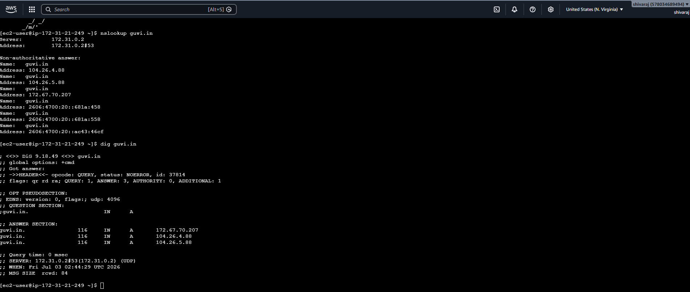
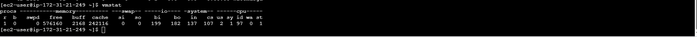
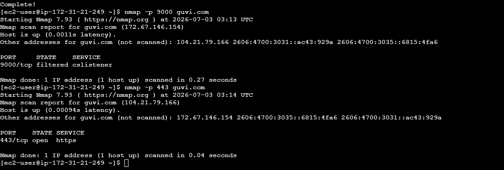
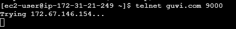
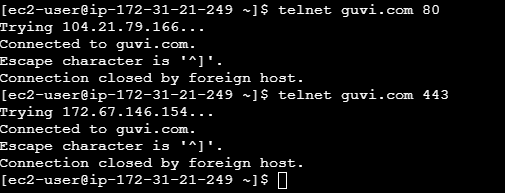

# Network Task

This task covers basic network diagnostics: DNS resolution, server resource monitoring, node connectivity testing, and port availability checks.

## 1. Get IP Address of a Domain (guvi.in)

Command used:
```bash
nslookup guvi.in
dig guvi.in
```

Output:



## 2. Check CPU / Memory Usage of Server

Command used:
```bash
top
vmstat
```

Output:



## 3. Test Connectivity Between Two Nodes

Command used:
```bash
ping guvi.in
```

Output:


## 4. Check if Port 9000 is Open (guvi.com:9000)

Commands used:
```bash
nmap -p 9000 guvi.com

telnet guvi.com 9000
telnet guvi.com 443
telnet guvi.com 80
```

Output:





### Findings
Starting Nmap 7.93 ( https://nmap.org ) at 2026-07-03 03:13 UTC
Nmap scan report for guvi.com (172.67.146.154)
Host is up (0.0011s latency).
Other addresses for guvi.com (not scanned): 104.21.79.166 2606:4700:3031::ac43:929a 2606:4700:3035::6815:4fa6

PORT     STATE    SERVICE
9000/tcp filtered cslistener

Nmap done: 1 IP address (1 host up) scanned in 0.27 seconds

## Tools/Tech Stack
- Shell (Git Bash / WSL / AWS CLI