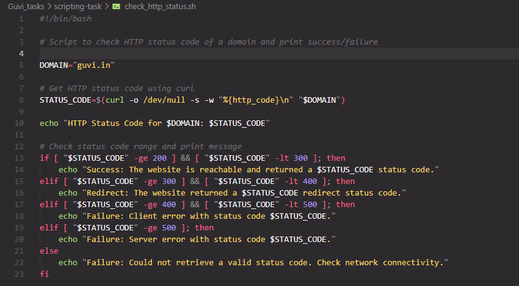
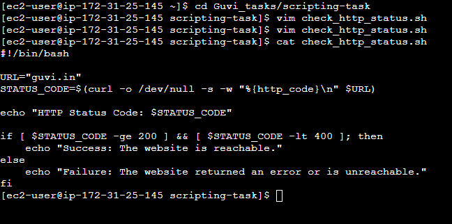
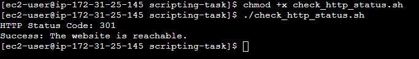
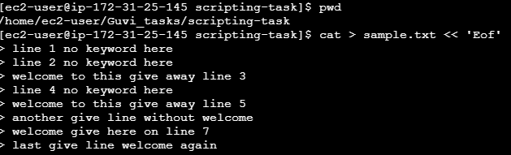
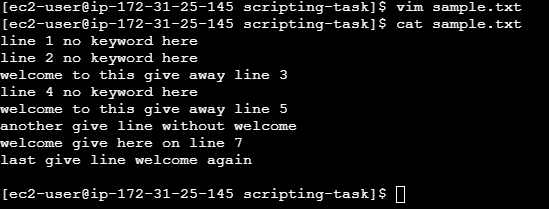
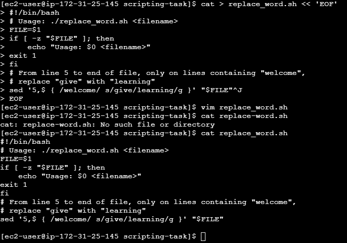
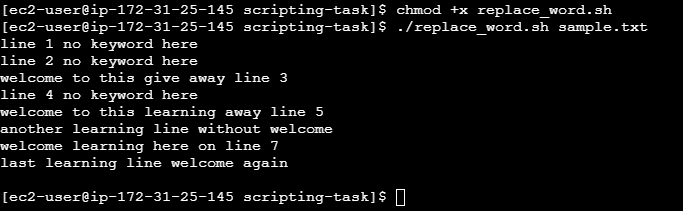

# Scripting Task

This task contains two shell scripts:
1. A script to check the HTTP status code of a domain and print a success/failure message.
2. A script to conditionally replace a word in a file using `sed`, only within a specific line range and only on lines matching a keyword.

Both scripts were written and executed on an AWS EC2 instance (Amazon Linux) using EC2 Instance Connect.

---

## Task 1: HTTP Status Code Checker

**Script:** `check_http_status.sh`

This script uses `curl` to fetch the HTTP status code of `guvi.in`, then prints whether the site is reachable based on the code range (2xx/3xx = success, 4xx/5xx = failure, anything else = connectivity issue).

### Script content



### Creating the script and viewing its content

The script was created using `vim`, then verified with `cat` to confirm it saved correctly.



### Making it executable and running it

```bash
chmod +x check_http_status.sh
./check_http_status.sh
```

**Output:** The script returned status code `301` (redirect) and correctly identified it as a success.



---

## Task 2: Conditional Word Replacement

**Script:** `replace_word.sh`

This script replaces every occurrence of the word `give` with `learning`, but only:
- From **line 5 to the end** of the file, **and**
- Only on lines that contain the word **"welcome"**

Lines before line 5, and lines without "welcome," are left untouched — this proves the script's condition logic is working correctly.

### Step 1: Creating the test input file (`sample.txt`)

A sample file was created using a heredoc (`cat > sample.txt << 'EOF' ... EOF'`) to have full control over exact line content and line numbers.

```bash
cat > sample.txt << 'EOF'
line 1 no keyword here
line 2 no keyword here
welcome to this give away line 3
line 4 no keyword here
welcome to this give away line 5
another give line without welcome
welcome give here on line 7
last give line welcome again
EOF
```



### Step 2: Verifying the input file

```bash
cat sample.txt
```



### Step 3: Creating the script

```bash
cat > replace_word.sh << 'EOF'
#!/bin/bash
# Usage: ./replace_word.sh <filename>
FILE=$1
if [ -z "$FILE" ]; then
    echo "Usage: $0 <filename>"
    exit 1
fi
# From line 5 to end of file, only on lines containing "welcome",
# replace "give" with "learning"
sed '5,$ { /welcome/ s/give/learning/g }' "$FILE"
EOF
```



### Step 4: Making it executable and running it

```bash
chmod +x replace_word.sh
./replace_word.sh sample.txt
```

**Output and verification:**

| Line | Content Before | Content After | Why |
|------|----------------|---------------|-----|
| 1 | `line 1 no keyword here` | unchanged | before line 5 |
| 2 | `line 2 no keyword here` | unchanged | before line 5 |
| 3 | `welcome to this give away line 3` | unchanged | before line 5 (even though it has "welcome" and "give") |
| 4 | `line 4 no keyword here` | unchanged | before line 5 |
| 5 | `welcome to this give away line 5` | `welcome to this **learning** away line 5` | line ≥5 and contains "welcome" |
| 6 | `another give line without welcome` | `another **learning** line without welcome` | line ≥5 and contains "welcome" |
| 7 | `welcome give here on line 7` | `welcome **learning** here on line 7` | line ≥5 and contains "welcome" |
| 8 | `last give line welcome again` | `last **learning** line welcome again` | line ≥5 and contains "welcome" |

This confirms the script correctly applies the replacement **only** where both conditions (line number ≥ 5, and line contains "welcome") are true.



---

## Tools/Tech Stack

- Shell (Bash) on AWS EC2 (Amazon Linux)
- `curl` for HTTP status checking
- `sed` for pattern-based text substitution
- Heredoc (`<< 'EOF'`) for reliable multi-line file creation over a remote terminal